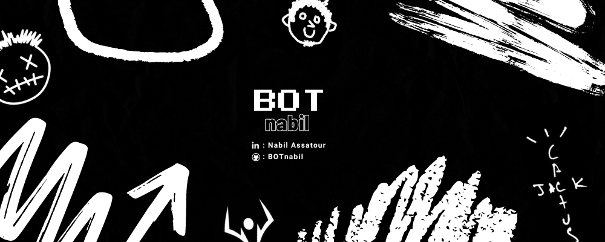

 ## 👋 Welcome to BOTnabil's place 🤖

<!--
**BOTnabil/BOTnabil** is a ✨ _special_ ✨ repository because its `README.md` (this file) appears on your GitHub profile.

Here are some ideas to get you started:

- 🔭 I’m currently working on ...
- 🌱 I’m currently learning ...
- 👯 I’m looking to collaborate on ...
- 🤔 I’m looking for help with ...
- 💬 Ask me about ...
- 📫 How to reach me: ...
- 😄 Pronouns: ...
- ⚡ Fun fact: ...
-->
Hi !  I am trying to improve in different languages.   
I love coding and tought it would be fun to make it my profession.

You can reach me there : [Nabil Assatour](https://www.linkedin.com/in/nabil-assatour-010196302/)

- 🌱 I’m currently working on my professional project for my internship, more infos bellow
- 😄 Pronouns: He/Him
- ⚡ Fun fact: Huge Persona nerd

## 🛠️ Languages and Tools :    

 
## 📈 My Github History
 
 
 
 
 
## 👨🏻‍💻 Currently working on "OhMyBeauty" !

 
Take a look on the freshly new project OMB, where the goal is to be able to make reservations as well as product orders on the brand's website !  

